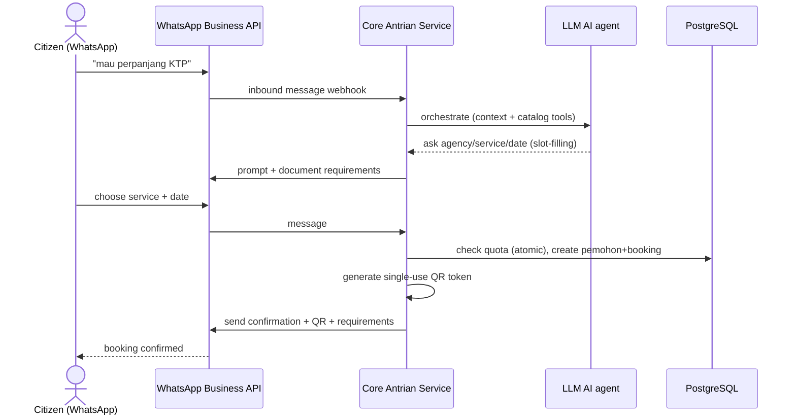
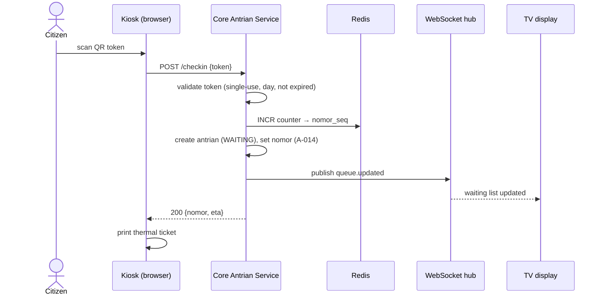
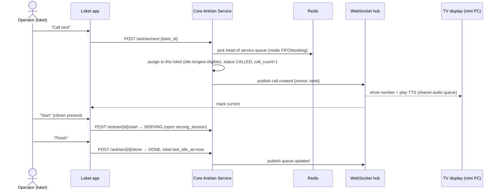
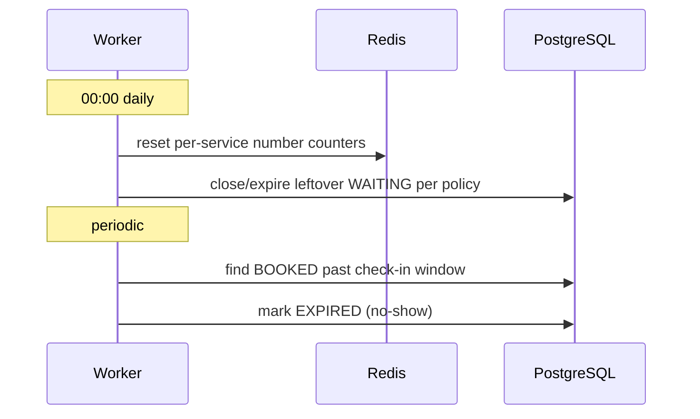

# Data Flow — key sequences _(EN)_

## 1. Registration via WhatsApp AI agent → booking + QR



## 2. On-site check-in (QR) → enqueue → ticket



## 3. Call next → serve → done (idle-longest allocation)



## 4. No-show: recall up to 3× then skip

```mermaid
sequenceDiagram
    actor O as Operator
    participant API as Core Antrian Service
    participant WS as WebSocket hub
    participant TV as TV
    O->>API: recall (call_count=2) 
    API->>WS: call.recalled → TV re-plays TTS
    O->>API: recall (call_count=3)
    API->>WS: call.recalled → TV re-plays TTS
    O->>API: no-show → skip
    API->>API: status SKIPPED; loket last_idle_at=now
    API->>WS: queue.updated
```

## 5. Second service (no re-registration)

```mermaid
sequenceDiagram
    actor O as Operator (loket A)
    participant API as Core Antrian Service
    participant WS as WebSocket hub
    O->>API: while SERVING, "needs second service (service X)"
    API->>API: current → QUEUED_NEXT; create child antrian (source SECOND_SERVICE, parent set) → WAITING at X
    API->>WS: queue.updated (service X)
    Note over API: same pemohon, new number in X's stream
```

## 6. Daily reset & booking expiry (worker)


