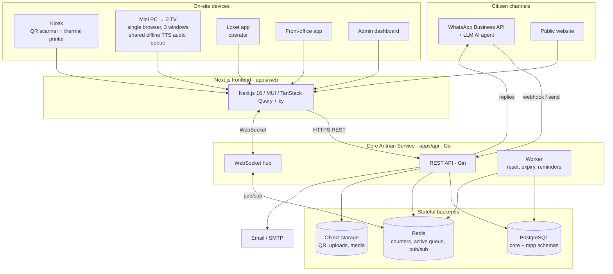

# System Architecture — MPP _(EN)_

## Overview

A **Core Antrian Service** (Go modular monolith) exposes REST + WebSocket + a
background worker. It owns the queue engine and persists to **PostgreSQL**, coordinates
real-time state in **Redis**, and stores media/QR in **object storage**. Citizens reach
it through **WhatsApp (AI agent)**, the **public web**, and on-site **devices** (kiosk,
TV, loket app). Staff use the **loket app**, **front-office app**, and **admin
dashboard** (all served by the Next.js frontend).

## Components

### Core Antrian Service (`apps/api`)
- **REST API (Gin):** catalog, registration, booking, check-in, queue operations,
  admin/master data, reporting. Response envelope `{data, message, meta, errors}`.
- **WebSocket hub:** pushes queue events to TVs, loket apps, admin dashboards; subscribes
  to Redis pub/sub so multiple API instances stay consistent.
- **Worker:** daily reset (00:00), booking-expiry sweep, reminder dispatch, quota
  housekeeping. (Skeleton's Dockerfile already supports a worker CMD variant.)
- **Modular monolith:** MPP domain under `internal/modules/mpp/<feature>/…`; reuses the
  skeleton's `{domain,dto,handler,repository,service}` pattern, plus `core` modules
  (auth, user, role, company) as-is.

### PostgreSQL
- `core` schema: users, roles, companies, audit (from skeleton).
- `mpp` schema: instansi, jenis_layanan, syarat_dokumen, loket, kuota, pemohon, booking,
  antrian, serving_session, fo_verification. Source of truth.

### Redis
- Atomic per-service **number counters**, **active-queue** ordered sets, **loket idle
  ranking**, and **pub/sub** channels for WebSocket fan-out. Also the skeleton's RBAC
  permission cache. Rebuildable from Postgres on cold start / after daily reset.

### Object storage
- QR images, uploaded FO documents (per privacy policy), TV media assets. Skeleton
  ships a GCS adapter; Supabase Storage (S3-compatible) is an alternative.

### Channels
- **WhatsApp Business API + LLM AI agent:** inbound webhook → agent orchestration →
  booking creation → outbound QR/confirmation. (See `../05-integrations/whatsapp-ai-agent.md`.)
- **Public web:** Next.js pages for citizen registration & public queue status.
- **Email/SMTP:** confirmations, reminders (skeleton `pkg/email`).

### On-site devices (browser-based where possible)
- **Kiosk:** QR scan for check-in + walk-in registration + thermal ticket printing.
- **Mini PC → 3 TVs:** one browser, three windows, one shared audio queue for offline
  Indonesian TTS. Resilient to internet loss.
- **Loket app / FO app / Admin dashboard:** Next.js routes behind auth.

## Cross-cutting

- **Auth:** JWT for users; scoped API-keys for unattended devices (kiosk/TV). RBAC
  enforced server-side (Redis-cached).
- **Realtime consistency:** all queue mutations go through the service, update
  Postgres + Redis, then publish an event; clients never mutate shared state directly.
- **Tenancy:** one MPP building = one company; agencies are entities within it.

## Deployment shape

Local: `docker-compose` (postgres + redis + api + web). Production: Kubernetes
(skeleton ships `deployments/kubernetes/`), Postgres via managed service/Supabase,
Redis via managed provider. See [`deployment.md`](./deployment.md).
