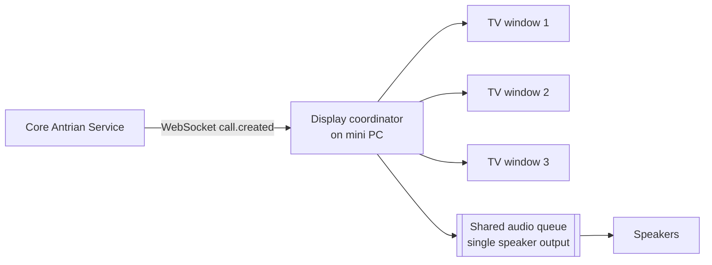

# Integration — TV Display & Offline TTS Voice Calling _(EN)_

When a number is called, the TV shows it **and speaks it** in Bahasa Indonesia. Voice
must work **without internet** (NFR-AVAIL-02).

## Hardware topology

- **One mini PC** drives **three TVs**.
- **One browser, three windows** (one per TV) render the display route.
- **One shared audio queue** across all three windows so announcements never overlap.

## Shared audio queue

Because three windows share one audio output, a **single coordinator** owns playback:

- Use a **`BroadcastChannel`** (or `SharedWorker`/`localStorage` lock) so the three
  windows elect **one leader** that plays audio; the others only render visuals.
- Incoming `call.created` / `call.recalled` events push `tts_text` onto a FIFO queue.
- The leader plays items **one at a time**; a new call waits for the current utterance
  to finish (no overlap, BR-18).
- De-dupe by `antrian_id` + event sequence.

## Producing speech offline

The `tts_text` string arrives ready-to-speak from the backend (see
[`../04-api/websocket-events.md`](../04-api/websocket-events.md)), e.g.
`"Nomor antrian A - nol satu empat, silakan menuju loket tiga"`. Options for **offline**
synthesis on the mini PC, in preference order:

1. **Pre-rendered audio fragments** — bundle Indonesian audio clips for digits (nol…
   sembilan), letters (A/B/C), and fixed phrases ("Nomor antrian", "silakan menuju
   loket"); concatenate per call. Fully deterministic, no engine, tiny latency. **Recommended.**
2. **Local offline TTS engine** installed on the mini PC (system TTS with an Indonesian
   voice, or a bundled offline model) invoked by a small local audio agent.
3. **Web Speech API (`speechSynthesis`)** with an Indonesian voice **only if** available
   locally — availability/quality varies by browser/OS and some voices need network, so
   treat as a fallback, not primary.

Store all audio assets **locally** on the mini PC; the display keeps functioning on the
last-known WebSocket snapshot during an outage and resumes on reconnect.

## Number-to-speech normalization

The backend generates `tts_text` so pronunciation is correct and consistent:

- Digits spoken individually: `014` → "nol satu empat".
- Prefix letter spoken as a letter: `A` → "A".
- Loket spoken as a number word: `Loket 3` → "loket tiga".
- Keep a small config map for phrasing (configurable TTS text, FR-CFG-03).

## Display content

- Prominent **current call** (big number + loket), plus a **next-up** list.
- Optional **running text / media** between calls (admin broadcast).
- High contrast, large type, legible from a distance (NFR-UX-02).

## Frontend placement

`apps/web` route (e.g. `/display/[instansi]`), a display coordinator module for the
leader election + audio queue, and locally-bundled audio assets under `public/`.
